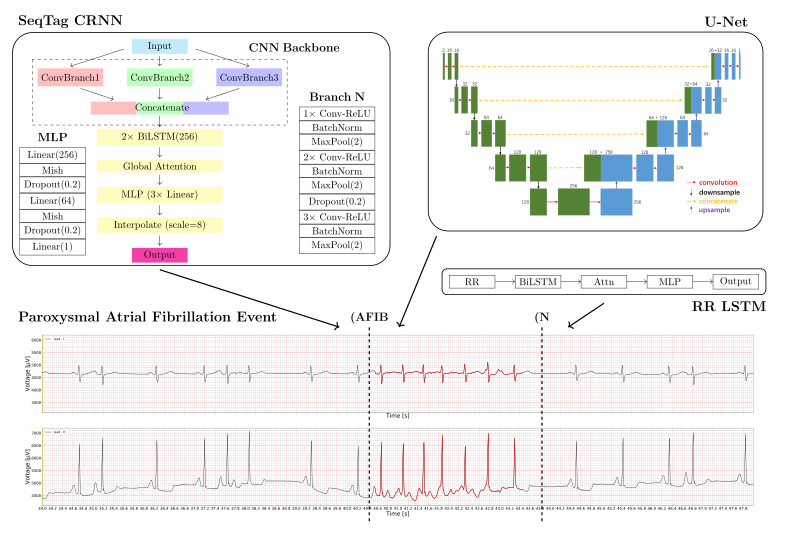

# CPSC2021

Paroxysmal Atrial Fibrillation Events Detection from Dynamic ECG Recordings: The 4th China Physiological Signal Challenge 2021

## Offline generated training data

[CPSC2021-sliced](https://www.kaggle.com/wenh06/cpsc2021-sliced) on Kaggle.

## Graphical Abstract of the Solution

## Main files

Click to view!

* Files required by the submission system
  - [`entry_2021.py`](entry_2021.py): entry file of the challenge
  - [`score_2021.py`](score_2021.py): scoring function of the challenge
* Files of the solution:
  - [`cfg.py`](cfg.py): configurations for the preprocessing, augmentation, model, trainer, etc.
  - [`data_reader.py`](data_reader.py): contains a class which makes reading data, annotations, etc. more easy
  - [`dataset.py`](dataset.py): torch Dataset which generates tensors for training the models
  - [`model.py`](model.py): models, adjustification of the architecture is highly flexible
  - [`trainer.py`](trainer.py): contains a trainer class
* Files for analyzing and visualizing experiments:
  - [`gather_results.py`](gather_results.py)
* Test files:
  - [`test_entry.py`](test_entry.py)
* Notebooks (the filenames imply the usages):
  - [`inspect_data.ipynb`](inspect_data.ipynb)
  - [`train_models.ipynb`](train_models.ipynb)
  - [`aggregate_val_res.ipynb`](aggregate_val_res.ipynb)

## Results (Rankings)

### Results on the hidden test set

Click to view!

<table class="table w-100 table-bordered text-center">
<tbody><tr class="table-primary font-weight-bold"><td style="width:12%">Name</td><td style="width:25%">Affiliation</td><td style="width:30%">Team Members</td><td style="width:10%">Test_I</td><td>Test_II</td><td>Average</td></tr>
<tr><td><a href="https://opensz.oss-cn-beijing.aliyuncs.com/icbeb2021/file/cpsc/1-usstmed.zip" target="_blank">usstmed</a></td><td>University of Shanghai for Science and Technology</td><td>Wenjie Cai, Fanli Liu, Bolin Xu, Xuan Wang, Yufeng Ji</td><td>2.0629</td><td>4.3921</td><td>3.2275</td></tr>

<tr><td><a href="https://opensz.oss-cn-beijing.aliyuncs.com/icbeb2021/file/cpsc/2-CeZIS.zip" target="_blank">CeZIS</a></td><td>1.VSL Software, a.s., Košice, Slovakia; 2.Pavol Jozef Šafárik University in Košice, Slovakia</td><td>Peter Bugata1, Peter Bugata Jr.1,  David Gajdos1, David Hudak1,Vladimira Kmecova1, Monika Stankova1, Lubomir Antoni2, Erik Bruoth2, Simon Horvat2, Richard Stana2, Alexander Szabari2, Gabriela Vozarikova2</td><td>2.1128</td><td>3.5716</td><td>2.8422</td></tr>

<tr><td><a href="https://opensz.oss-cn-beijing.aliyuncs.com/icbeb2021/file/cpsc/3-UNIWA.zip" target="_blank">UNIWA</a></td><td>University of West Attica, Greece</td><td>Lampros Kokkalas, Nicolas A. Tatlas, Stelios M. Potirakis</td><td>2.0144</td><td>3.3833</td><td>2.6989</td></tr>
<tr><td><a href="https://opensz.oss-cn-beijing.aliyuncs.com/icbeb2021/file/cpsc/4-lingshui_BME.zip" target="_blank">lingshui_BME</a></td><td>1.Dalian University of Technology; 2.RWTH Aachen University</td><td>Yating Hu1, Tengfei Feng2, Hong Tang1</td><td>1.8754</td><td>3.5116</td><td>2.6935</td></tr>
<tr><td><a href="https://opensz.oss-cn-beijing.aliyuncs.com/icbeb2021/file/cpsc/5-Taozi.zip" target="_blank">Taozi</a></td><td>Tianjin Medical University, Beihang University</td><td>Jingsu Kang, Hao Wen </td><td>1.9972</td><td>3.0907</td><td>2.5440</td></tr>
<tr><td><a href="https://opensz.oss-cn-beijing.aliyuncs.com/icbeb2021/file/cpsc/6-Metformin-121.zip" target="_blank">Metformin-121</a></td><td>National Taiwan University; Academia Sinica; Taiwan Artificial Intelligence Academy Foundation</td><td>Tsai-Min Chen, Yi-Dar Tang, Huan-Hsin Tseng, Wei Luok Ngu, Le-Yin Hsu, Miao-Chen Chiang, Yu-Te Ku, Ming-Yi Hong, Yu Tsao</td><td>1.6277</td><td>2.6649</td><td>2.1463</td></tr>
<tr><td><a href="https://opensz.oss-cn-beijing.aliyuncs.com/icbeb2021/file/cpsc/7-MVTECH.zip" target="_blank">MVTECH</a></td><td>Shanghai Medical Vision Technology Co. Ltd.</td><td>Yang Hou, Jinlei Li</td><td>1.7966</td><td>2.4346</td><td>2.1156</td></tr>
<tr><td><a href="https://opensz.oss-cn-beijing.aliyuncs.com/icbeb2021/file/cpsc/8-FUDU_Car.zip" target="_blank">FUDU_Car</a></td><td>Fudan University</td><td>Sen  Liu, Ya‘nan Wang, Haijun Jia </td><td>1.9147</td><td>1.9473</td><td>1.9310</td></tr>
<tr><td><a href="https://opensz.oss-cn-beijing.aliyuncs.com/icbeb2021/file/cpsc/9-WHS.zip" target="_blank">WHS</a></td><td> 1.Central South University 2.China University of Geosciences</td><td>Lebing Pan, Jiechen Tang</td><td>1.8585</td><td>1.9236</td><td>1.8911</td></tr>
<tr><td><a href="https://opensz.oss-cn-beijing.aliyuncs.com/icbeb2021/file/cpsc/10-Muhammad%20Uzair%20Zahid.zip" target="_blank">Muhammad Uzair Zahid</a></td><td>1. Tampere University, Finland; 2. Qatar University, Qatar</td><td>Muhammad Uzair Zahid1, Mustafa Serkan Kiranyaz2, Moncef Gabbouj1</td><td>1.8192</td><td>1.9469</td><td>1.8831</td></tr>
<tr><td><a href="https://opensz.oss-cn-beijing.aliyuncs.com/icbeb2021/file/cpsc/11-DaBin.zip" target="_blank">DaBin</a></td><td>Beijing University of Technology</td><td>Fengya Liu, Rui Yu, Shuicai Wu, Guangyu Bin,Zhuhuang Zhou ,Qian Wang</td><td>1.8352</td><td>0.9728</td><td>1.4040</td></tr>
<tr><td><a href="https://opensz.oss-cn-beijing.aliyuncs.com/icbeb2021/file/cpsc/12-Lastone.zip" target="_blank">Lastone</a></td><td>King's College London, UK</td><td>Xinqi Bao, Fenghe Hu</td><td>0.9616</td><td>1.6430</td><td>1.3023</td></tr>
<tr><td><a href="https://opensz.oss-cn-beijing.aliyuncs.com/icbeb2021/file/cpsc/13-BSU%E5%B7%A5%E7%A8%8B%E5%B0%8F%E5%88%86%E9%98%9F(1).zip" target="_blank">BSU工程小分队</a></td><td>Beijing Sport University</td><td>Kuan Tao, Lixin Sun</td><td>1.2384</td><td>1.1710</td><td>1.2047</td></tr>
<tr><td><a href="https://opensz.oss-cn-beijing.aliyuncs.com/icbeb2021/file/cpsc/14-CUTCM.zip" target="_blank">CUTCM</a></td><td>City University of Hong Kong</td><td>Marshall</td><td>0.6706</td><td>1.3854</td><td>1.0280</td></tr>
<tr><td><a href="https://opensz.oss-cn-beijing.aliyuncs.com/icbeb2021/file/cpsc/15-AZ-unet.zip" target="_blank">AZ-unet</a></td><td>AstraZeneca</td><td>Hannes Whittingham, Long Luu</td><td>1.1168</td><td>0.7788</td><td>0.9478</td></tr>
<tr><td><a href="https://opensz.oss-cn-beijing.aliyuncs.com/icbeb2021/file/cpsc/16-AIBI_LAB.zip" target="_blank">AIBI_LAB</a></td><td>Ludong University</td><td>Shuhong Wei,  Yipeng Wang, Yu Ji, Yinhao Sun</td><td>0.7837</td><td>1.1006</td><td>0.9422</td></tr>
<tr><td><a href="https://opensz.oss-cn-beijing.aliyuncs.com/icbeb2021/file/cpsc/17-CPSC_eie.zip" target="_blank">CPSC_eie</a></td><td>Zhejiang University of Technology, China</td><td>Xinyuan Ying, Qing Pan, Ziyou Zhang</td><td>0.8555</td><td>0.9629</td><td>0.9092</td></tr>
<tr><td>Baseline</td><td>/</td><td>/</td><td>0.6819</td><td>0.6485</td><td>0.6652</td></tr>
</tbody></table>

See the [official website](http://2021.icbeb.org/CPSC2021) for more details.

### Results on the validation set

Raw results are gathered into one zip file, the `val_res.zip` in the [`results`](/results/) folder

|     Network(s)    | Merge Rule    | Score on Partial Hidden Test Set | Score on Validation Set|
|-------------------|---------------|----------------------------------|------------------------|
|   LSTM            |  NA           |   1.9392                         | 2.0621                 |
|   SeqTag          |  NA           |   1.9781                         | 2.1577                 |
|   U-Net           |  NA           |   1.3699                         | NA                     |
|  LSTM + U-Net     |  Union        |   1.7829                         | NA                     |
|  LSTM + SeqTag    | Intersection  |   1.9287                         | NA                     |
|  LSTM + SeqTag    |  Union        |   1.9766                         | 2.1682                 |
| **LSTM + SeqTag** | **New Union** |   **1.9972**                     | **2.2179**             |

### Confusion matrices of the LSTM model and the SeqTag model

  
  &nbsp; &nbsp; &nbsp; &nbsp;&nbsp; &nbsp; &nbsp; &nbsp;
  

### More detailed analysis using `pandas`

  
  

## Citation

See the file [CITATIONS.bib](CITATIONS.bib). Also at [sciencedirect](https://www.sciencedirect.com/science/article/pii/S0022073622001972).

## References

See the references listed on the [sciencedirect webpage](https://www.sciencedirect.com/science/article/pii/S0022073622001972).
